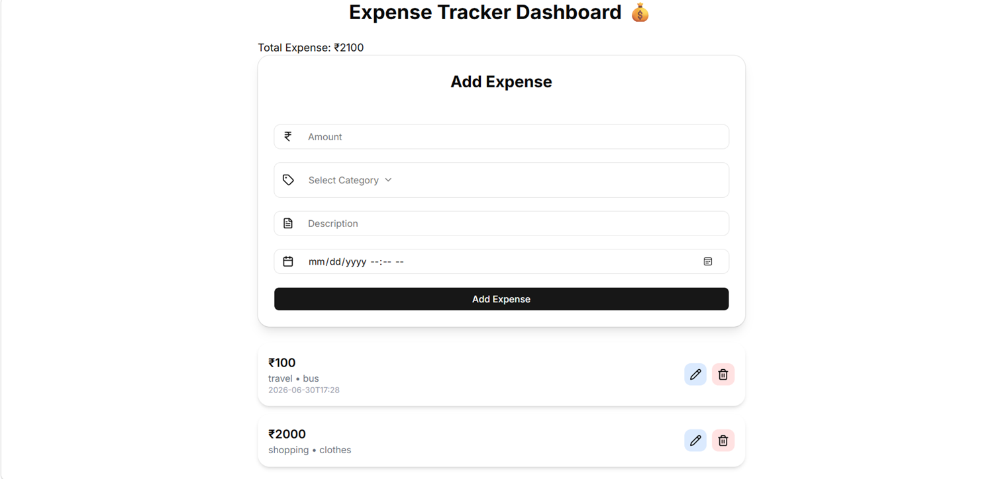

# 💰 Expense Tracker

A simple and responsive **Expense Tracker** built using **React**, **Vite**, **Tailwind CSS**, and **shadcn/ui**. It helps users manage their income and expenses with an easy-to-use interface.

---

## 📸 Screenshot

Add your project screenshot inside the **public** folder.

```md

```

---

## ✨ Features

* ➕ Add income and expenses
* 🗑️ Delete transactions
* 💵 View total balance
* 📊 Track income and expenses
* 📅 Display transaction date
* 📱 Responsive Design

---

## 🛠️ Tech Stack

* React
* Vite
* Tailwind CSS
* shadcn/ui
* Lucide React

---

## 🚀 Getting Started

Clone the repository

```bash
git clone https://github.com/your-username/expense_tracker.git
```

Go to the project folder

```bash
cd expense_tracker
```

Install dependencies

```bash
npm install
```

Start the development server

```bash
npm run dev
```

---

## 📦 Build

```bash
npm run build
```

---

## 👩‍💻 Author

**Srushti Malod**
